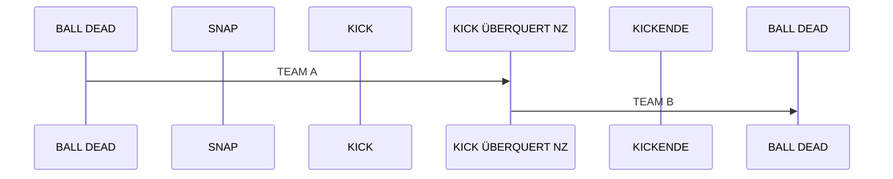
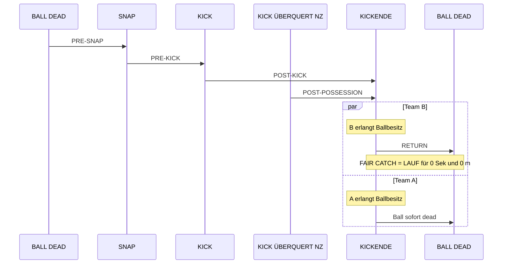
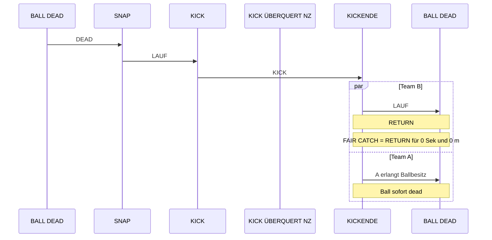
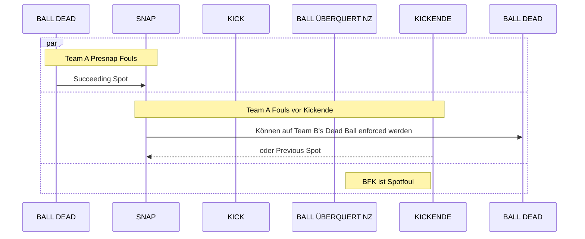
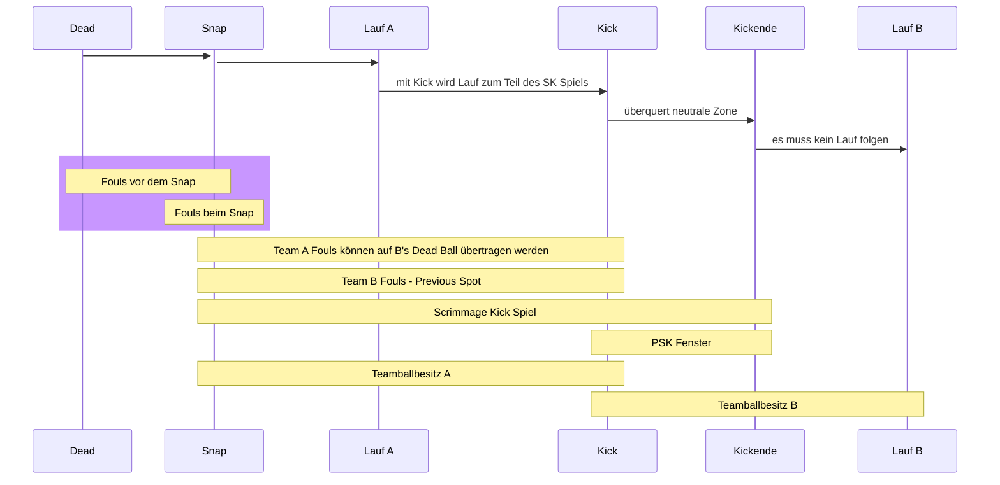
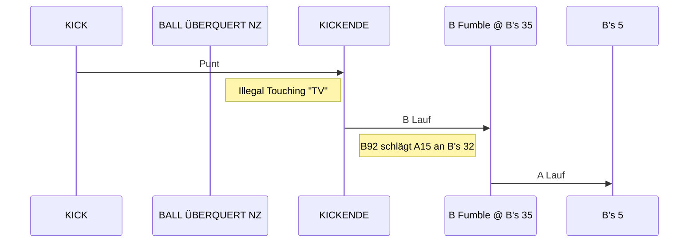
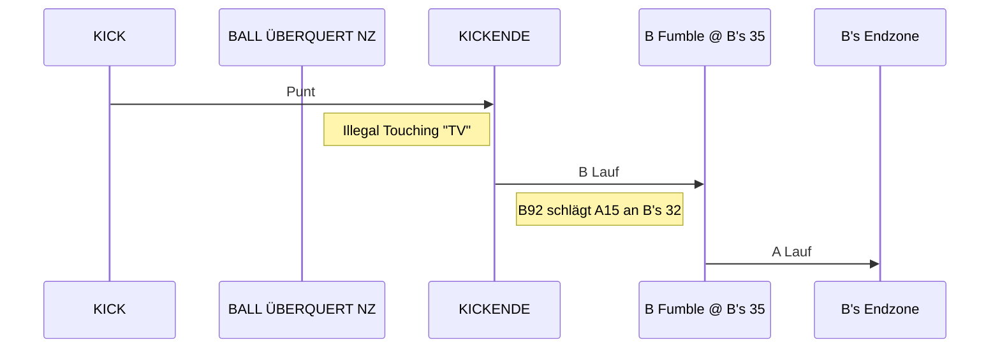
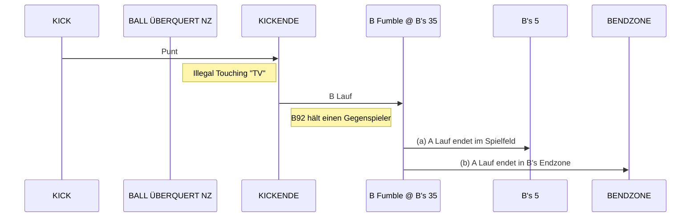

# Scrimmage Kicks

## Diagramme

### Teamballbesitz während eines Scrimmage Kick Downs

- kein Schnickschnack
- keine Violation
- Team B am Ende des Downs im Ballbesitz

### Phasen eines Scrimmage Kick Downs

### Status des Balles während Scrimmage Kick Downs

### Team A Fouls

### zu viel in einer Grafik

## Beispiele

### Redding Study Guide 11-87

A's Punt überquert die Neutrale Zone. A34 begeht eine Touching Violation. B23 recovert den Ball und läuft bis an B's 35, wo er fumbelt. Während dieses Laufes schlug B92 einen Gegenspieler an B's 32. A42 recovert den Ball und läft damit,  
(a) bis an B's 5, wo er getackelt wird.  
(b) bis in B's Endzone für einen Touchdown.  

#### a - Lauf endet an B's 5

#### b - Lauf endet in B's Endzone

##### Regelung:  
Unter (a) kann Team A den Ball nicht bekoomen. Lehnt A die Strafe für das persönliche Foul ab, bekommt Team B den Ball am Punkt der Touching Violation. Nimmt A die Strafe an, wird die Touching Violation aufgehoben. Die Strafdurchführung gibt jedoch B den Ball, weil B zum Zeitpunkt des Fouls in Ballbesitz war. Die Strafe wird nach dem 3-und-1 Prinzip vom Punkt des Fouls durchgeführt, da das Foul hinter dem Basic Spot (Ende von B's Lauf) stattfand.  
Unter (b) belibt der Touchdown bestehen. Die Stafe für Team B's Foul wird beim Try oder anschließenden Succeeding Spot geahndet.

#### Redding Study Guide 11-88

A's Punt überquert die Neutrale Zone. A34 begeht eine Touching Violation. B23 recovert den Ball und läuft bis an B's 35, wo er fumbelt. Während dieses Laufes hielt  B92 einen Gegenspieler. A42 recovert den Ball und läft damit,  
(a) bis an B's 5, wo er getackelt wird.  
(b) bis in B's Endzone für einen Touchdown.  

#### Diagramm

##### Regelung:  
Unter (a) ist die Regelung dieselbe wie oben unter 11-87. A kann den Ball nicht behalten. Team B bekommt den Ball entweder durch die Touching Violation (wenn Strafe abgelehnt) oder nach Durchführung der Strafe für das eigene Foul ...
Unter (b) **zählt der Touchdown in diesem Fall nicht**, da es während des Downs eine Touching Violation gab und diese die Strafdurchführung möglich ermöglicht. Die Strafe wird nicht durch die Regel aufgehoben. Team A kann wählen Team B den Ball entweder am Punkt der Touching Violation zu geben oder an dem Punkt an den der Ball durch die Strafdurchführung kommt.
