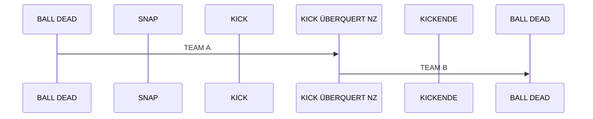
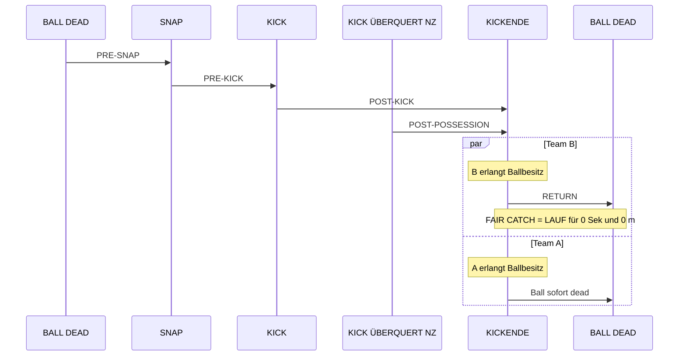
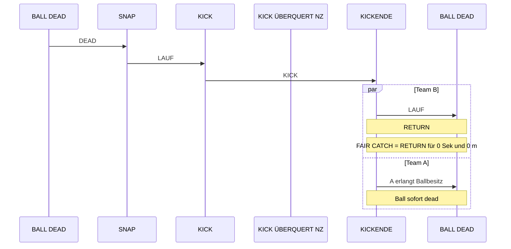
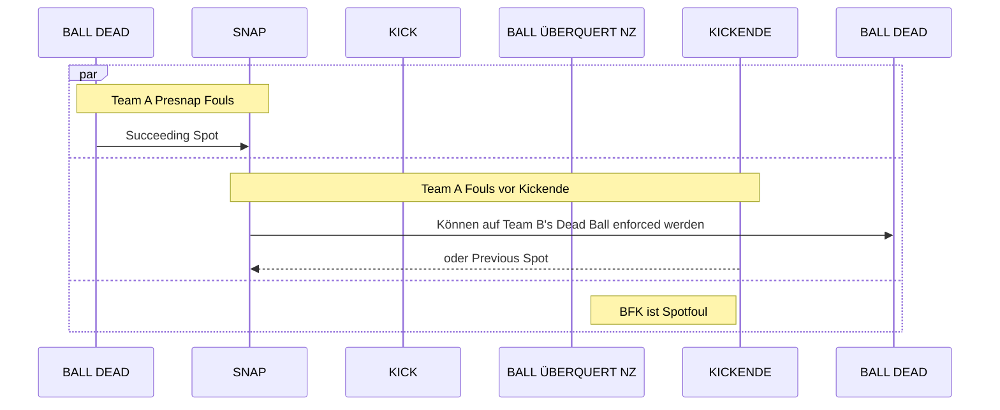
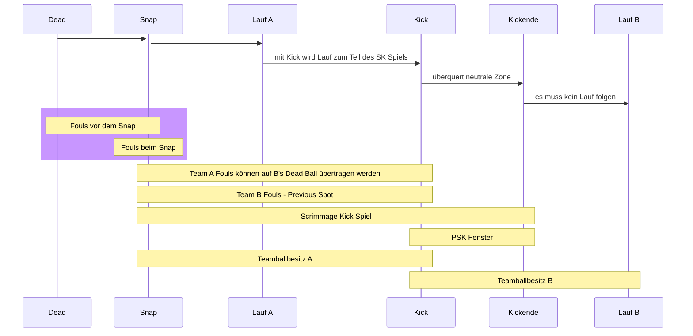

# Scrimmage Kicks

## Diagramme

### Teamballbesitz während eines Scrimmage Kick Downs

- kein Schnickschnack
- keine Violation
- Team B am Ende des Downs im Ballbesitz

### Phasen eines Scrimmage Kick Downs

### Status des Balles während Scrimmage Kick Downs

### Team A Fouls

### zu viel in einer Grafik

## Post Scrimmage Kick Enforcement

#### Artikel 3. Postscrimmage Kick Enforcement

a) Gemäß den Postscrimmage Kick Enforcement Regeln werden Team B-Fouls, die die unter Regel 10-2-3b aufgeführten Bedingungen erfüllen, behandelt, als wäre Team B zum Zeitpunkt, als das Foul verursacht wurde, in Ballbesitz gewesen, obwohl der Team Ballbesitz gemäß Regel 2-4-1b-3 nicht gewechselt hat.
b) Postscrimmage Kick Enforcement trifft nur auf Team B-Fouls während eines Scrimmage Kicks und nur unter den nachfolgend aufgeführten Bedingungen zu:
    1. DerKickwirdnichtwährendeinesTry,eineserfolgreichenFieldgoals oder in einer Extraperiode durchgeführt (A.R. 10-2-3-IV).
    2. Der Ball überquert die neutrale Zone.
    3. Das Foul ereignet sich, bevor der Kick endet (A.R. 10-2-3-I, -II und -V).
    4. Team B wird als nächstes den Ball ins Spiel bringen. 
Wenn diese Bedingungen alle zutreffen, wird die Strafe nach dem Drei-und-Eins-Prinzip durchgeführt. Team B wird als das Team in Ballbesitz betrachtet mit dem       Postscrimmage Kick Spot als Basic Spot (Regel 10-2-2-c). Siehe Regel 2-25-11 für den Postscrimmage Kick Spot (A.R. 10-2-3-I-VII).
