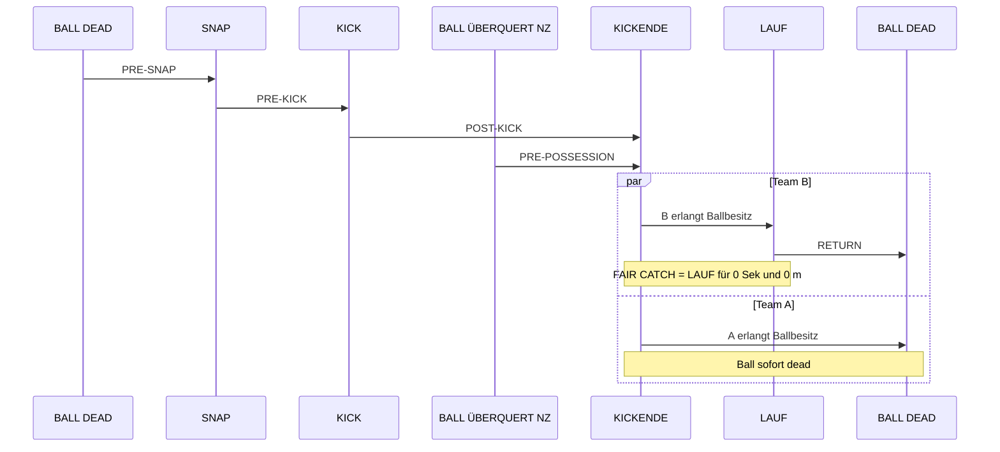
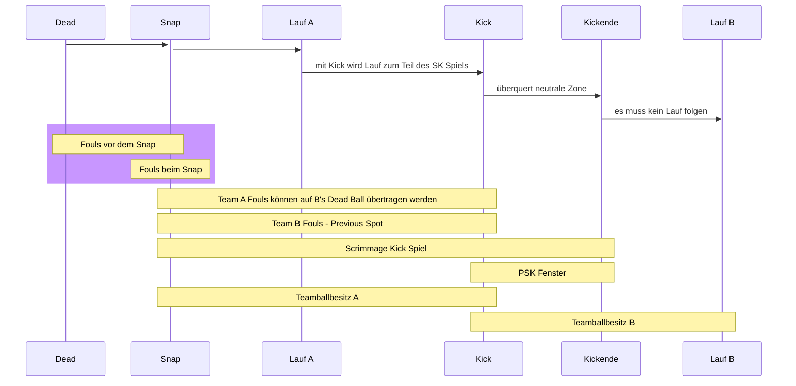

# Scrimmage Kicks

## Diagrams

### Phasen eines Scrimmage Kick Downs

```mermaid
sequenceDiagram
    participant PREDEAD as BALL DEAD
    participant SNAP
    participant KICK
    participant NZ as BALL ÜBERQUERT NZ
    participant KICKENDE
    participant LAUF
    participant BALL DEAD
    PREDEAD->>SNAP: PRE-SNAP
    SNAP->>KICK: PRE-KICK
    KICK->>KICKENDE: POST-KICK
    NZ->>KICKENDE: PRE-POSSESSION
    par Team B
    KICKENDE->>LAUF: B erlangt Ballbesitz
    LAUF->>BALL DEAD: RETURN
    note over KICKENDE,LAUF: FAIR CATCH = LAUF für 0 Sek und 0 m
    and Team A
    KICKENDE->>BALL DEAD: A erlangt Ballbesitz 
    note over KICKENDE,BALL DEAD: Ball sofort dead   
    end
```

``` mermaid
sequenceDiagram 
    Dead->>+Snap: 
    Snap->>Lauf A: 
    Lauf A->>Kick: mit Kick wird Lauf zum Teil des SK Spiels
    Kick->>Kickende: überquert neutrale Zone 
    Kickende->>Lauf B: es muss kein Lauf folgen
    rect rgb(200, 150, 255)
    note over Dead,Snap: Fouls vor dem  Snap
    note over Snap: Fouls beim Snap
    end
    note over Snap,Kick: Team A Fouls können auf B's Dead Ball übertragen werden
    note over Snap,Kick: Team B Fouls - Previous Spot 
    note over Snap,Kickende: Scrimmage Kick Spiel
    note over Kick,Kickende: PSK Fenster
    note over Snap,Kick: Teamballbesitz A
    note over Kick,Lauf B: Teamballbesitz B
```

